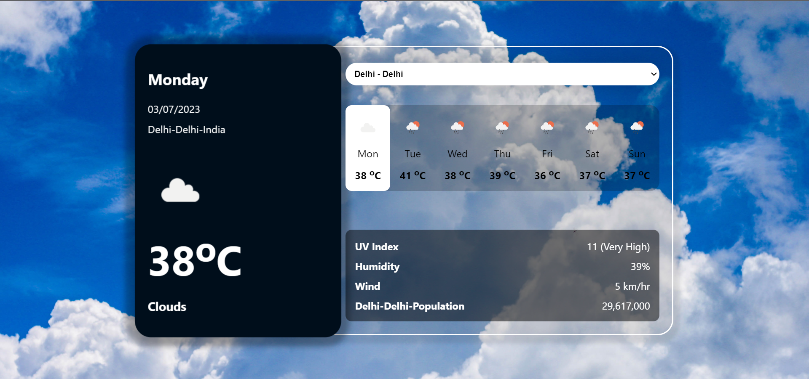

# Weather Application

This application is to find the weather of the cities around India. It is all responsive and can be used in any device and along with the temperature we can check the humidity, UV rays, population of the city and wind speed. We can also find the weather condition of the city and know if it is rainy, sunny or cloudy day.

## functions of the application

#### `1. find the weather condition in degree celcius`
#### `2. find the UV rays condition of the city`
#### `3. find wind speed of the city`
#### `4. find the humidity in the city`
#### `5. find the population of the city`
#### `6. get the full forcast for next 7 days.`

## overview of the application

## find the deployed link here

#### Deployed Link Here :- [https://weather-app-nine-omega-58.vercel.app/] 
